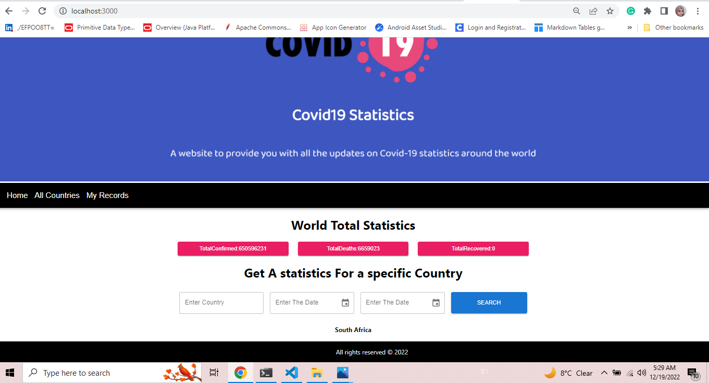
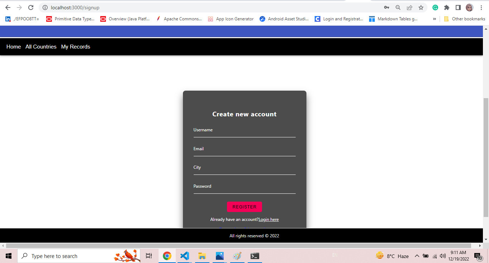
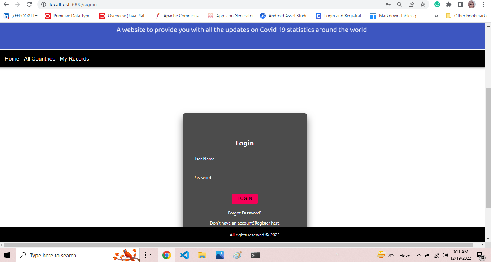
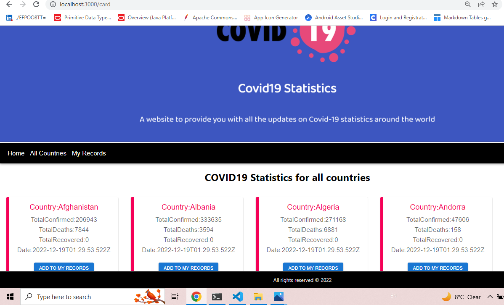

## COVID-19 FrontEnd
 Webapp which provides the users with all the updates on Covid-19 statistics around the world 

This is the deployed link  ***[deployed link]()***

## How we build the app 

* We build the app using react js , react-redux , and the best part we used react-redux toolkit , using async thunk .

* Lets see all required dependence's that we will use as mention below :

    * "@mui/material": "^5.10.7",
    * "@reduxjs/toolkit": "^1.8.5",
    * "axios": "^0.27.2",
    * "base-64": "^1.0.0",
    * "chart.js": "^3.9.1",
    * "emailjs-com": "^3.2.0",
    * "material": "^0.4.3",
    * "mdb-react-ui-kit": "^4.2.0",
    * "react": "^18.2.0",
    * "react-cookies": "^0.1.1",
    * "react-dom": "^18.2.0",
    * "react-jwt": "^1.1.7",
    * "react-redux": "^8.0.4",
    * "react-router-dom": "^6.4.1",
    * "react-scripts": "5.0.1",
    * "react-toastify": "^9.0.8",
    * "sass": "^1.49.9",
    * "reactstrap": "^9.1.4",
    * "sweetalert2": "^11.4.37",
    * "web-vitals": "^2.1.4"
## Screenshots structure for your Webapp
In ***Home*** page

In ***signup*** page

In ***signin*** page

In ***All Countries*** page

